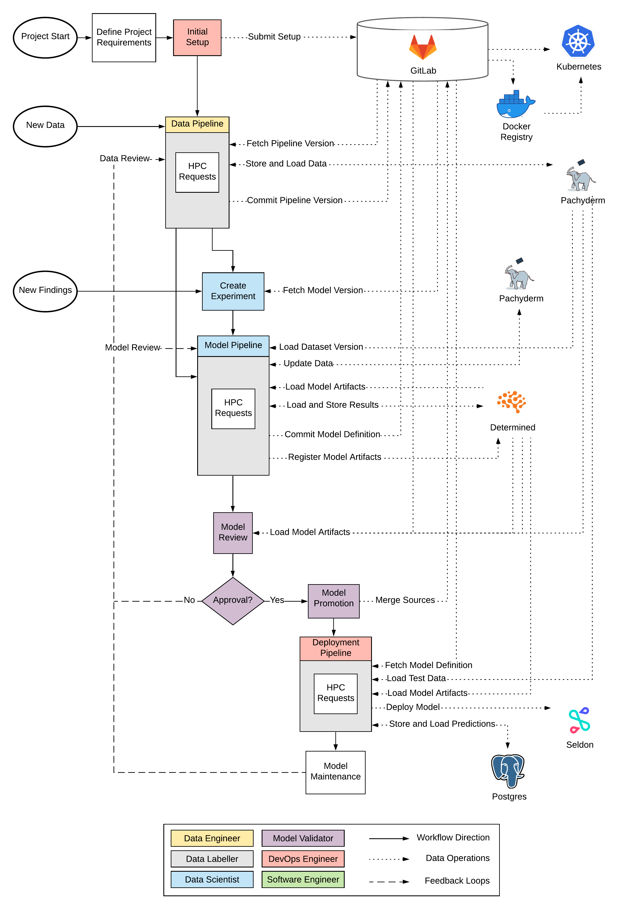

# Continuous Deep Learning

This repository includes the corresponding source code of the thesis "Continuous Deep Learning".

Researchers have been highly active to investigate the traditional machine learning workflow and integrate best practices from the software engineering lifecycle. However, deep learning exhibits deviations which are not yet covered in this conceptual development process. This includes the requirement of dedicated hardware, dispensable feature engineering, extensive hyperparameter optimization, large-scale data management and model compression to reduce size and inference latency.

In this thesis, we defined a detailed deep learning workflow that incorporates these characteristics on the baseline of the traditional machine learning workflow. We further transferred the conceptual idea into practice by building a prototypic deep learning system using the latest technologies on the market. To examine the feasibility of the workflow, two use cases were applied to the prototype. The first use case represented a text classification problem, while the second use case focused on image processing. We thereby successfully demonstrated the application of the workflow on distinct examples.

In summary, it becomes apparent that the deep learning lifecycle compromises a large set of steps and involves various roles. With our defined workflow, we present a profound guideline for the deep learning development process.

The contents of this repository are the following:

- SETUP: An installation guideline and required setup files
- BBC - Use Case 1: source code for the text classification use case
- FMNIST - Use Case 2: source code for the image classification use case

Both use cases include their individual README for guidance.

Where to start? Read through the `setup/setup.md` and spin up your infrastructure. Then you can apply the use cases and modify them to your needs or build your own. A summary of the prototype is illustrated in the following figure: 
