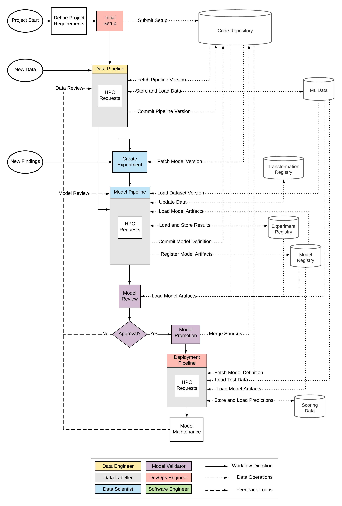

# Continuous Deep Learning

This repository includes the corresponding source code of the thesis "Continuous Deep Learning". Within this research, we define a conceptual workflow for deep learning, implement a prototype and apply two uses cases.

The contents of this repository are the following:

- SETUP: An installation guideline and required setup files
- BBC - Use Case 1: source code for the text classification use case
- FMNIST - Use Case 2: source code for the image classification use case

Both use cases include their individual README for guidance.

Where to start? Read through the `setup/setup.md` and spin up your infrastructure. Then you can apply the use cases and modify them to your needs or build your own.

